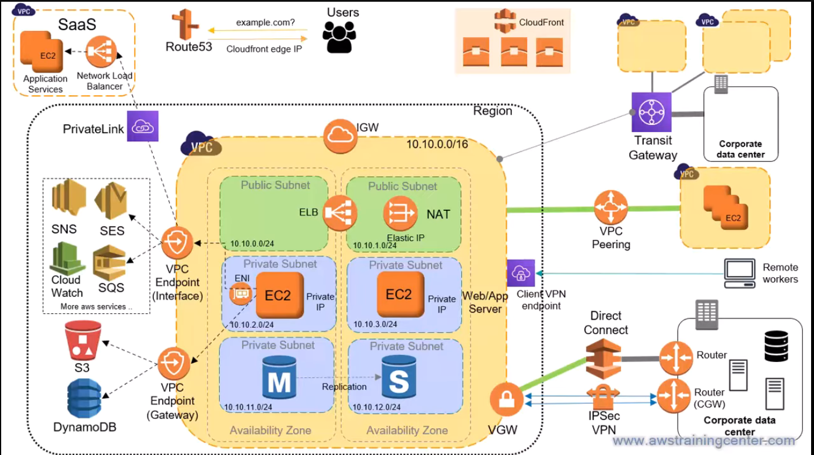



# AWS Networking 

AWS networking is a VPC (your private network) plus the gateways, endpoints, DNS, and edge services that connect it to the internet, other VPCs, and on-prem environments. 

## 1. VPC Core: The Building Blocks

A VPC is a logically isolated network in one Region, defined by a CIDR block. In the diagram, the VPC uses `10.10.0.0/16`, which gives 65,536 total IPs. Everything else lives inside the VPC or attaches to it.

### Core concepts

- Region/AZ: A VPC spans all AZs in its Region, while a subnet lives in exactly one AZ. Use two or more AZs for HA.
- Subnet: A subnet is a slice of the VPC CIDR such as `10.10.0.0/24` or `10.10.1.0/24`. "Public" vs "private" is determined by the route table, not by the subnet itself.
- Route table: A route table contains destination CIDR -> target rules. Every subnet is associated with one route table. The local route (`10.10.0.0/16`) is always present and cannot be removed.
- Internet Gateway (IGW): A horizontally scaled, highly available gateway that gives a VPC internet access. A subnet is public when its route table contains `0.0.0.0/0 -> igw-xxxx` and the instance has a public or Elastic IP.
- NAT Gateway: A NAT Gateway lives in a public subnet with an Elastic IP. Private subnets route `0.0.0.0/0 -> nat-xxxx` so instances can go out to the internet for patching or APIs, but the internet cannot initiate connections inbound. One NAT per AZ is recommended for HA.
- ENI: An Elastic Network Interface is a virtual network card with a private IP, security groups, and a MAC. EC2 instances, NAT Gateways, load balancers, and interface endpoints all use ENIs.
- Elastic IP: A static public IPv4 address you own until you release it. It is charged when idle or when attached as a public IPv4.

### Typical 3-tier layout

| Tier | Subnet | Route to internet |
| --- | --- | --- |
| Load balancer / NAT | Public (`10.10.0.0/24`, `10.10.1.0/24`) | `0.0.0.0/0 -> IGW` |
| Web / App EC2 | Private (`10.10.2.0/24`, `10.10.3.0/24`) | `0.0.0.0/0 -> NAT GW` |
| Database (primary + standby) | Private (`10.10.11.0/24`, `10.10.12.0/24`) | None (local only) |

AWS reserves 5 IP addresses per subnet: network address, VPC router, DNS, future use, and broadcast. A `/24` subnet therefore gives 251 usable addresses.

## 2. Traffic Control: Security Groups, NACLs, and Load Balancers

Security groups are the primary firewall and are stateful, attached to each ENI. NACLs are an additional optional layer and are stateless, attached to the subnet.

| Feature | Security Group | Network ACL |
| --- | --- | --- |
| Level | ENI / instance | Subnet |
| State | Stateful (return traffic auto-allowed) | Stateless (must allow both directions and ephemeral ports) |
| Rules | Allow only | Allow and deny |
| Evaluation | All rules together | Numbered order, first match wins |
| Default | Deny all inbound, allow all outbound | Allows all by default; custom NACLs deny all |
| Source | CIDR or another security group | CIDR only |

Best practice: reference security groups by SG ID (`web-sg -> app-sg -> db-sg`) instead of raw CIDRs, and use NACLs only for explicit subnet-wide denies such as blocking a bad IP range.

### Elastic Load Balancing

The ELB in the public subnet is typically:

- ALB: Layer 7 (HTTP/HTTPS), supports path/host-based routing, WebSockets, and WAF integration. Best for modern web apps and microservices.
- NLB: Layer 4 (TCP/UDP/TLS), ultra-low latency, static IP per AZ, preserves client IP. Required for PrivateLink services.
- GWLB: Layer 3 gateway for third-party appliances such as firewalls and IDS.

Targets sit in private subnets; only the load balancer is public.

## 3. Route 53 and CloudFront (DNS and Edge)

Route 53 is AWS's global, highly available DNS service with 100% SLA. In the diagram, users resolve `example.com` and get back a CloudFront edge IP.

Route 53 does three main things:

- Domain registration
- DNS (public and private hosted zones)
- Health checks

### Route 53 records and policies

- Public hosted zone: answers queries from the internet.
- Private hosted zone: answers only from associated VPCs. Requires `enableDnsHostnames` and `enableDnsSupport` on the VPC.
- Alias record: Route 53-specific record pointing to AWS resources such as ALB, CloudFront, or S3 website endpoints. It is free to query and works at the zone apex where a CNAME is not allowed.
- Route 53 Resolver: VPC DNS (`base+2`, e.g. `10.10.0.2`). Inbound and outbound endpoints forward queries between VPCs and on-prem DNS.

| Routing policy | Use it for |
| --- | --- |
| Simple | One resource, no health logic |
| Weighted | A/B tests and gradual migration (90/10) |
| Latency | Sending users to the lowest-latency Region |
| Failover | Active-passive DR using health checks |
| Geolocation | Routing by user country or continent |
| Geoproximity | Routing by distance, with bias |
| Multivalue answer | Up to 8 healthy records for simple client-side balancing |

CloudFront is the CDN: it has 400+ edge locations, caches content near users, terminates TLS, and forwards cache misses to an origin such as S3, ALB, or an HTTP server. Pair it with WAF and Shield for DDoS protection and use Origin Access Control to keep S3 private.

## 4. VPC-to-VPC and Service Connectivity

Use VPC peering for a few VPCs, Transit Gateway for many, and endpoints or PrivateLink to reach services without going over the internet.

### VPC Peering

- One-to-one private connection between two VPCs in the same or different Region/account.
- CIDRs must not overlap.
- Not transitive: if A-B and B-C are peered, A cannot reach C directly.
- You must add routes in both route tables and allow traffic in the security groups.
- Full mesh of N VPCs requires `N(N-1)/2` peerings, which does not scale well.

### Transit Gateway (TGW)

- Regional hub-and-spoke router.
- Attach VPCs, VPNs, and Direct Connect once, and all connected networks can reach each other transitively.
- Route tables on the TGW control segmentation, such as isolating prod from dev.
- Supports inter-Region peering and multicast.
- Charged per attachment-hour and per GB processed.

### VPC Endpoints

| Type | Services | Implementation | Cost | On-prem / peered VPC access |
| --- | --- | --- | --- | --- |
| Gateway endpoint | S3, DynamoDB | Route table entry (prefix list) | Free | No |
| Interface endpoint | Most AWS services (SNS, SQS, CloudWatch, SES, API Gateway, etc.) | ENI with private IP in your subnet | Hourly + per GB | Yes |

AWS PrivateLink allows you to expose a service behind an NLB to other VPCs or accounts as an interface endpoint. Traffic stays private, overlapping CIDRs are not a problem, and consumers only see the endpoint, not your whole VPC.

## 5. Hybrid Connectivity: On-Prem and Remote Users

On-premises networks can connect over the internet via Site-to-Site VPN or through a dedicated private line using Direct Connect. Remote users connect with Client VPN.

- Virtual Private Gateway (VGW): AWS-side VPN / DX concentrator attached to one VPC.
- Customer Gateway (CGW): Represents your on-prem router or device.
- Site-to-Site VPN: IPsec tunnels over the internet, usually two tunnels per connection for HA, up to ~1.25 Gbps per tunnel. Quick to set up, encrypted, and inexpensive, but performance can vary.
- Direct Connect (DX): Dedicated 1/10/100 Gbps fiber from your DC to an AWS DX location. Lower latency and lower data-transfer cost, but takes longer to provision and is not encrypted by default.
  - Private VIF -> VPC through VGW / DX Gateway
  - Public VIF -> AWS public services
  - Transit VIF -> Transit Gateway
- AWS Client VPN: Managed OpenVPN-based service for remote workers. Authenticate via AD, SAML, or certificates.
- VPN CloudHub: Connect multiple on-prem sites to one VGW so they can communicate through AWS.

## 6. Which Connectivity Option to Pick

| Need | Pick | Why / catch |
| --- | --- | --- |
| Private link between 2 VPCs | VPC Peering | Simple and cheap, but non-transitive and requires non-overlapping CIDRs |
| 10+ VPCs, on-prem, shared services | Transit Gateway | Hub-and-spoke, transitive, route segmentation, but charged per GB |
| Reach S3 / DynamoDB privately | Gateway endpoint | Free and route-table based |
| Reach other AWS services privately | Interface endpoint | Uses PrivateLink and ENIs; hourly + per-GB cost |
| Expose your service to other accounts / VPCs | PrivateLink (NLB + endpoint service) | Works with overlapping CIDRs |
| Quick, encrypted on-prem link | Site-to-Site VPN | Over the internet, easy to set up |
| Stable, high-throughput on-prem link | Direct Connect | Dedicated connectivity, but slower to provision |
| Remote employees | Client VPN | Managed OpenVPN |
| Private subnet outbound to internet | NAT Gateway | Per-AZ cost, per-GB charge |
| Global DNS routing and failover | Route 53 | Alias records, health checks |

## 7. Interview Q&A

### Basics

1. What makes a subnet public? A subnet is public when its route table has `0.0.0.0/0 -> Internet Gateway`, and the instance has a public or Elastic IP. The subnet type is really just a routing outcome.
2. How many IPs does AWS reserve per subnet? AWS reserves 5: network address, VPC router, DNS, future use, and broadcast. A `/24` subnet gives 251 usable addresses.
3. What is the allowed VPC CIDR size? Between `/16` and `/28` for IPv4. You can add secondary CIDRs later, but plan non-overlapping ranges early since peering, TGW, and VPN rely on them.
4. Internet Gateway vs NAT Gateway? An IGW gives two-way internet access to resources with public IPs. A NAT Gateway provides outbound-only internet access for private instances and sits in a public subnet with an Elastic IP.
5. A private instance cannot reach the internet. How do you troubleshoot? Check the route table (`0.0.0.0/0 -> NAT`), confirm the NAT Gateway is in a public subnet whose route table points to the IGW, make sure it has an Elastic IP, verify outbound security group rules, check NACLs for both directions and ephemeral ports, and confirm DNS resolution.
6. Security group vs NACL? A security group is stateful, attached to ENIs, and generally used for allow-only rules. A NACL is stateless, attached to a subnet, supports allow and deny, and evaluates rules in numeric order. Use SGs by default and NACLs for explicit denies.
7. Can a security group reference another security group? Yes. Security groups can reference other security groups as sources or destinations, which scales better than hardcoding CIDRs.
8. What is an ENI and why does it matter? An ENI is a virtual NIC with private IP(s), security groups, and a MAC address. Interface endpoints, NAT Gateways, ELBs, and Lambda-in-VPC all create ENIs. ENI exhaustion is a real failure mode on small subnets.
9. Elastic IP vs public IP? A public IP is assigned automatically and can change when the instance is stopped/started. An Elastic IP is static and remains yours until released.

### Connectivity

10. What are the limitations of VPC peering? No overlapping CIDRs, not transitive, no edge-to-edge routing, and you must add routes on both sides.
11. Peering vs Transit Gateway? Peering is 1:1, simple, and cheap, but it does not scale well. TGW is hub-and-spoke, transitive, and better for 10+ VPCs or hybrid environments.
12. Gateway endpoint vs interface endpoint? Gateway endpoints are for S3 and DynamoDB only, route-table-based, and free. Interface endpoints are ENI-based and support most AWS services, but they have hourly and per-GB charges.
13. How do you let a private EC2 read S3 without internet access? Create an S3 gateway endpoint and associate it with the private subnet's route table. You can also restrict access with endpoint and bucket policies using `aws:SourceVpce`.
14. What is PrivateLink and when would you use it? PrivateLink exposes a service through an interface endpoint without requiring VPC peering. It is ideal for SaaS vendors or when CIDRs overlap.
15. How do you connect 50 VPCs and on-prem? Use Transit Gateway with VPC attachments and a VPN or Direct Connect attachment. Separate route tables can isolate production and development traffic.

### Hybrid and DNS

16. Site-to-Site VPN vs Direct Connect? VPN is IPsec over the public internet, quick to deploy, and cheap, but latency varies. Direct Connect uses dedicated private connectivity with consistent performance, but it takes longer to provision and is not encrypted by default.
17. How do you make Direct Connect highly available? Use two Direct Connect connections in different locations, or pair DX with Site-to-Site VPN as a backup using BGP.
18. VGW vs CGW vs TGW? A VGW is the AWS-side VPN endpoint attached to one VPC. A CGW represents your on-prem device. TGW is a regional hub that replaces per-VPC VGWs at scale.
19. What is a Route 53 alias record and why use it over a CNAME? An alias maps a name to an AWS resource such as ALB, CloudFront, or S3 website endpoints. It is free to query, auto-tracks IP changes, and is allowed at the zone apex where CNAME is not.
20. Explain Route 53 routing policies. Simple = single resource; Weighted = traffic split; Latency = nearest Region; Failover = active-passive based on health checks; Geolocation = by user location; Geoproximity = by distance with bias; Multivalue = multiple healthy records.
21. Public vs private hosted zone? A public hosted zone answers queries from the internet. A private hosted zone resolves only from associated VPCs and requires DNS support and hostname options enabled on the VPC.
22. How do on-prem and AWS resolve each other's DNS names? Use Route 53 Resolver. An inbound endpoint lets on-prem send DNS queries into AWS; an outbound endpoint plus forwarding rules lets AWS resolve names in on-prem DNS.

### Scenarios

23. Design a highly available 3-tier web app network. Use a VPC with 2+ AZs. Put the ALB and one NAT Gateway per AZ in public subnets. Put EC2 instances in private app subnets behind the ALB, and Multi-AZ RDS in private database subnets. Use SG chain `ALB -> app -> DB`, Route 53 alias to the ALB, and optionally CloudFront in front.
24. NAT costs are high. How do you reduce them? Add S3 and DynamoDB gateway endpoints, use interface endpoints for AWS service traffic, keep traffic in-AZ where possible, and reduce unnecessary egress. NAT charges hourly and per GB processed.
25. Two VPCs have overlapping CIDRs and must communicate. What are the options? VPC peering and Transit Gateway will not work if CIDRs overlap. Use PrivateLink (NLB + endpoint service) for specific services, or renumber one of the VPCs.

### Troubleshooting tools to mention in an interview

- VPC Flow Logs: shows accepted and rejected traffic per ENI
- Reachability Analyzer: checks whether a path between resources is possible
- Traffic Mirroring: captures traffic for inspection
- CloudWatch metrics: NAT, TGW, Route 53, VPN, and DX metrics
- `traceroute` and `dig` from the instance: useful for connectivity and DNS debugging
